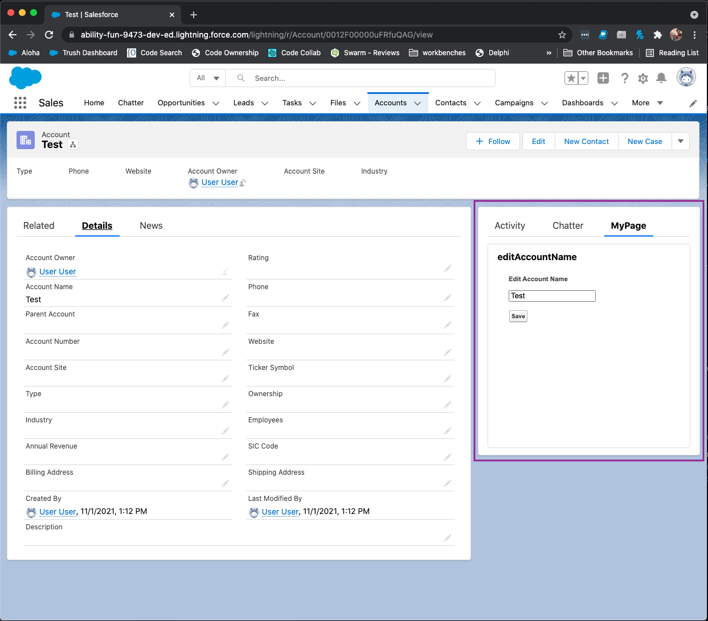

# Sample Dialogs
Test update readme
Custom modal dialogs to replace the native alert and confirm dialogs.

## Introduction
This project introduces **showAlert()** and **showConfirm()** in the dialog.js file. These functions allow users to display alert and confirm modal dialogs in Visualforce pages.
The dialog.js in this sample project provides **showAlert()** and **showConfirm()** which can be used to display an alert and confirm dialog in Visualforce pages.\

**Note:** The native **alert()** and **confirm()** functions are synchronous. When a native dialog is open on a page, other code running on the page is halted until the native dialog is closed.\

**showAlert()** or **showConfirm()** are asynchronous. This means that post actions such as form submissions will proceed even if a modal is open. To pause a post action until a modal dialog is closed, users must implement **event.preventDefault()** in addition to **showAlert()** or **showConfirm()()**.


## Installation Instructions

### Prerequisites
* [Salesforce CLI](https://developer.salesforce.com/tools/sfdxcli)
* [Enable Dev Hub in your org](https://help.salesforce.com/s/articleView?id=sf.sfdx_setup_enable_devhub.htm&type=5)

### Steps
1. Clone this repository:

    ```
    git clone https://github.com/forcedotcom/dialog-samples
    cd dialog-samples
    ```

2. Authorize with your Dev Hub org and provide it with an alias. The sample command below uses the alias **mydevorg**.

    ```
    sfdx auth:web:login -d -a mydevorg
    ```

2. Create a scratch org and provide it with an alias. The sample command below uses the alias **dialog-samples**.

    ```
    sfdx force:org:create -s -f config/project-scratch-def.json -a dialog-samples
    ```

3. Push the app to your scratch org:

    ```
    sfdx force:source:push
    ```

4. If your org isn't already open, open it now:

    ```
    sfdx force:org:open
    ```

5. In **Setup**, verify that the **dialog_samples** static resource and the **editAccountName** Visualforce page exist.

6. Click on an account name to view the account page, and select Edit Page. Add the **editAccountName** page to the page layout.

7. Saves your changes and click **Back** to return the Account page. Now, you should see the Visualforce page embedded in the page layout:



8. To see an example of a confirm dialog, rename the account and save your changes. A confirm modal dialog should appear.

9. To see an example of an alert dialog, add a special characer like !@#$%^&*() to the account name and save your changes. An alert dialog should display to indicate an error.
